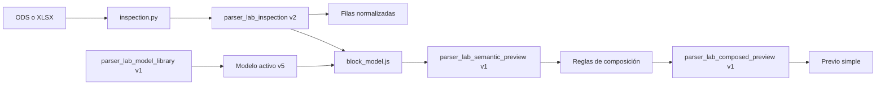

# Parser Lab: arquitectura, funcionalidad y handoff de auditoría UX/UI

Fecha de referencia: 2026-07-23

Aplicación verificada: Créditos `0.1.78`

Rama de implementación: `agent/parser-lab-model-workflow`

Commit de referencia: `7947e6c`
PR borrador: <https://github.com/jtorrens/Creditos/pull/1>

## 1. Propósito del documento

Este documento describe el estado actual de la pestaña aislada **Parser Lab**, las decisiones funcionales y visuales tomadas durante su construcción y los límites que debe respetar cualquier trabajo posterior.

También sirve como handoff autocontenido para abrir un nuevo hilo dedicado a:

- auditar la arquitectura de la sección;
- revisar su modelo mental y su flujo de trabajo;
- detectar errores funcionales y ambigüedades de contrato;
- evaluar problemas de UX, UI, accesibilidad y escalabilidad;
- proponer mejoras priorizadas;
- implementar únicamente las mejoras que el usuario autorice después de revisar el diagnóstico.

El nuevo hilo no debe depender del historial de conversación que produjo la implementación.

## 2. Misión y límite fundamental

Parser Lab es un laboratorio para construir y probar reglas de interpretación de hojas de cálculo de créditos. Permite observar las filas normalizadas de un ODS/XLSX, definir fronteras de bloques, interpretar sus filas y comparar un resultado semántico antes de promover un modelo a producción.

No es un editor de créditos de producción ni un nuevo import model registrado.

La frontera no negociable es:

> Parser Lab puede leer una copia del resultado normalizado de los lectores compartidos, pero no puede modificar el origen, la base de datos activa, los modelos de importación registrados ni la salida de producción.

La promoción de una regla probada a `apps/renderer/import_models` requiere una tarea y autorización explícitas distintas.

## 3. Estado Git y artefactos

- La implementación está en `agent/parser-lab-model-workflow`.
- El PR de integración a `main` es el borrador #1.
- El commit `7947e6c` es la base publicada de Parser Lab; las mejoras posteriores incorporan la biblioteca local, las fronteras estructurales y elevan la aplicación a `0.1.78`.
- `data/creditos.db` no forma parte del commit ni del PR.
- El ejecutable usado para la verificación fue:
  `apps/desktop/dist/mac-arm64/Creditos.app`.
- La biblioteca experimental del usuario no se versiona. Vive por defecto en:
  `~/.creditos/parser-lab/model-library.json`.
- El antiguo `block-model.json` se migró una sola vez a la biblioteca. La copia
  `block-model.migrated-v5.json` es solo respaldo de esa operación y el código actual
  no contiene fallback al contrato retirado.

## 4. Reglas de aislamiento

Leer completamente antes de actuar:

- `AGENTS.md`
- `apps/renderer/parser_lab/AGENTS.md`

El trabajo de esta pestaña debe permanecer en:

- `apps/renderer/parser_lab/`
- `scripts/check_parser_lab.py`
- `scripts/check_parser_lab_blocks.js`
- documentación específica como este archivo.

No se puede modificar desde una auditoría o mejora de Parser Lab:

- `data/creditos.db`;
- `apps/renderer/import_models/`;
- el registro de import models;
- la interpretación de producción;
- materiales, cartelas, estructura, render, preview general o exportación;
- sincronización Git/DB o procesos nativos de Electron;
- lógica general compartida para acomodar la pestaña.

Si una mejora necesita cruzar esa frontera, hay que detenerse, explicar la necesidad y pedir autorización específica.

## 5. Arquitectura actual

### 5.1 Mapa de archivos

| Archivo | Responsabilidad |
|---|---|
| `apps/renderer/parser_lab/inspection.py` | Construye el snapshot aislado de filas normalizadas. Reutiliza lectores compartidos sin ejecutar un import model. |
| `apps/renderer/parser_lab/service.py` | Carga, valida y guarda la biblioteca JSON experimental y sus modelos; expone la operación de inspección. |
| `apps/renderer/parser_lab/block_model.js` | Dominio puro del laboratorio: validación, detección de bloques, interpretación semántica y composición. |
| `apps/renderer/parser_lab/ui.js` | Estado de sesión, eventos, sincronización de paneles, formularios, tablas y previo. |
| `apps/renderer/parser_lab/parser_lab.css` | Layout, tema de la pestaña, tabla clara, tabs, formularios y previo. |
| `apps/renderer/parser_lab/AGENTS.md` | Frontera de propiedad del paquete. |
| `scripts/check_parser_lab.py` | Comprueba aislamiento frente a parsers de producción, contratos Python y persistencia. |
| `scripts/check_parser_lab_blocks.js` | Comprueba el modelo de bloques, interpretación, composición y presencia de contratos UI críticos. |

Integraciones mínimas ya existentes fuera del paquete:

- `apps/renderer/server.py` registra tres operaciones HTTP de Parser Lab.
- La navegación general carga la pestaña y sus assets.
- `scripts/check_creditos_safety.py` incluye los checks del laboratorio.

Estas integraciones no autorizan a trasladar lógica del laboratorio a los archivos generales.

### 5.2 Flujo de datos



La UI no debe contener algoritmos alternativos de parsing. Debe editar el contrato, invocar el dominio y representar el resultado.

### 5.3 Endpoints aislados

| Método | Ruta | Resultado |
|---|---|---|
| `POST` | `/api/parser-lab/inspect-source` | Inspección normalizada del archivo cargado. |
| `POST` | `/api/parser-lab/associated-source` | Copia del archivo asociado al capítulo y modelo activos. |

La barra de Parser Lab identifica siempre la procedencia de la fuente inspeccionada. Distingue entre el ODS/XLSX predeterminado procedente de Cartelas y un archivo temporal cargado únicamente en Parser Lab, y muestra el nombre concreto del archivo en ambos casos. La selección temporal no modifica la fuente asociada en Cartelas.

La navegación por filas usa actualizaciones incrementales. Cambiar de fila dentro del mismo bloque no reconstruye la tabla, las pestañas ni el previo: solo actualiza la selección, el inspector y el ítem navegable. Al cambiar de bloque se actualizan las pestañas y se reconstruye únicamente el previo activo. Los renders completos quedan reservados para cambios del archivo, modelo o reglas de interpretación.
| `GET` | `/api/parser-lab/model-library` | Biblioteca local, modelo activo y ruta de persistencia. |
| `POST` | `/api/parser-lab/model-library` | Crear, duplicar, renombrar, borrar, seleccionar o guardar modelos con validación estricta. |

Los modelos se guardan en SQLite. La carga del origen asociado es de solo lectura
para Parser Lab.

## 6. Contratos de datos

### 6.1 Inspección normalizada

Contrato: `parser_lab_inspection`, versión 2.

Contiene:

- nombre y tipo del archivo;
- hoja elegida y lista de hojas;
- columnas fijas A–D;
- filas normalizadas;
- valores de celda;
- estilos disponibles;
- negritas por columna;
- indicador `merged_b_to_d`;
- indicador `empty`.

Las filas vacías internas se restauran usando la numeración original. Esta decisión es esencial: una fila vacía puede representar una división de ítem, grupo o página y no puede descartarse durante la inspección.

Al entrar por primera vez en Parser Lab se inspecciona automáticamente la copia
del ODS/XLSX asociado al capítulo y modelo activos, si existe. La tabla
`source_files` conserva esos bytes junto a la importación. El botón de carga del
laboratorio puede sustituir el archivo temporalmente en esa pestaña, pero nunca
modifica la asociación ni los documentos usados por Cartelas.

Ejemplo reducido:

```json
{
  "row": 6,
  "values": { "A": "", "B": "Montaje", "C": "", "D": "Editora Uno" },
  "styles": {},
  "bold": { "B": false },
  "merged_b_to_d": false,
  "empty": false
}
```

### 6.2 Biblioteca local y modelo experimental

Contrato contenedor: `parser_lab_model_library`, versión 1.

Cada modelo tiene `id` estable, nombre único, revisión, fechas de creación y
actualización, y un documento `parser_lab_block_model` versión 7. La biblioteca
mantiene un único `active_model_id` y permite quedar vacía después de borrar el
último modelo. Crear, duplicar, renombrar y borrar se realizan desde la barra
superior con diálogos propios de Parser Lab; duplicar copia toda la regla y genera
una identidad nueva.

Contrato: `parser_lab_block_model`, versión 8.

Estructura superior:

```json
{
  "schema": "parser_lab_block_model",
  "version": 8,
  "blocks": [],
  "composition_rules": [],
  "normalized_rows_view": {
    "column_widths": {}
  }
}
```

El contrato es estricto y no incluye migraciones silenciosas. Cuando cambia, el JSON usado durante el desarrollo se migra una sola vez y el código anterior desaparece.

Contratos retirados que no deben reintroducirse:

- rol tipográfico `neutral`;
- orientación `horizontal_grouped`;
- objeto redundante `interpretation.separator`;
- `normalized_rows_view.collapsed_columns`;
- recuperación automática desde una ubicación temporal antigua.

### 6.3 Definición de bloque

```json
{
  "id": "block_05_equipo_tecnico",
  "name": "Equipo técnico",
  "enabled": true,
  "header": {
    "source": "match",
    "column": "C",
    "operator": "equals",
    "value": "Equipo técnico",
    "bold": "required",
    "merged_b_to_d": "ignore"
  },
  "interpretation": {
    "type": "principal_with_associated_values",
    "content_start": "after_header",
    "orientation": "horizontal",
    "item_grouping": "first_term",
    "item_start_column": "B",
    "item_start_merged_b_to_d": "ignore",
    "traversal": "row_major",
    "split_cell_lines": true,
    "term_roles": {
      "first": "secondary",
      "following": "principal"
    },
    "empty_rows": {
      "leading": { "effect": "continue", "display": "ignore" },
      "between_items": { "effect": "item", "display": "compact" },
      "trailing": { "effect": "continue", "display": "ignore" }
    }
  }
}
```

### 6.4 Cabecera y frontera

Una definición se busca de forma secuencial a partir de la cabecera anterior. La primera fila que cumple la regla se convierte en inicio del bloque. El final es la fila anterior a la siguiente cabecera encontrada o el final de la hoja.

Condiciones disponibles:

- origen `match`, `sheet_start`, `after_previous` o `sheet_end`;
- columna A, B, C o D;
- operador `equals`, `contains`, `regex` o `nonempty`;
- negrita ignorada, requerida o prohibida;
- combinación B–D ignorada, requerida o prohibida.

Una definición desactivada:

- continúa delimitando el rango;
- no produce ítems en el previo;
- se muestra como ignorada.

Este comportamiento permite omitir bloques como agradecimientos sin destruir las fronteras de los bloques vecinos.

### 6.5 Orientación y creación de ítems

Son decisiones ortogonales.

**Orientación** describe la colocación o lectura visual de términos:

- `vertical`: términos distribuidos hacia abajo;
- `horizontal`: términos asociados en línea.

**Creación de ítems** define la frontera semántica:

- `empty_rows`: acumula términos hasta una fila vacía configurada como frontera;
- `row`: crea un ítem por cada fila con contenido;
- `first_term`: acumula filas hasta encontrar otro valor en `item_start_column`.

Cuando se usa `first_term`, `item_start_merged_b_to_d` permite ignorar, exigir o
prohibir una combinación B–D en la fila que inicia el ítem. Encontrar otro primer
término solo crea otro ítem; los saltos de grupo o página pertenecen exclusivamente
a las políticas explícitas de filas vacías.

El orden dentro de cada ítem es siempre de izquierda a derecha y de arriba abajo. Las líneas internas de una celda también se separan y conservan su posición.

### 6.6 Roles tipográficos

El laboratorio solo asigna dos roles a los términos interpretados:

- `principal`: normalmente Nombre;
- `secondary`: normalmente Cargo.

El primer término puede ser principal o secundario. Todos los términos siguientes reciben el segundo rol configurado.

Categorías tipográficas generales acordadas:

1. Cartela: texto libre de nivel superior que puede agrupar bloques y páginas. No se interpreta como término ordinario del bloque.
2. Título de bloque: corresponde a la cabecera/frontera.
3. Cargo: normalmente secundario.
4. Nombre: normalmente principal.

Para un ítem con un único valor, el usuario elige explícitamente si adopta el estilo principal o secundario.

### 6.7 Filas vacías

Se distinguen tres posiciones:

- desde la cabecera hasta el primer ítem (`leading`);
- entre ítems (`between_items`);
- desde el último ítem hasta el siguiente bloque (`trailing`).

Cada posición combina dos decisiones:

**Efecto semántico**

- continuar el mismo ítem;
- siguiente ítem;
- salto de grupo;
- salto de página.

**Representación del espacio**

- ignorar;
- compactar a una fila;
- respetar el número original de filas.

La política semántica y la representación del hueco no deben volver a mezclarse en un único campo.

### 6.8 Reglas de composición

Las reglas de composición son posteriores a la interpretación normal del bloque.

Pueden actuar sobre:

- un ítem cuyo `principal` coincida;
- un bloque cuyo `name` coincida.

Operadores:

- igual;
- contiene;
- expresión regular.

Acción actual:

- agrupar el nodo coincidente con los siguientes N nodos;
- destino `group`, `page` o `cartela`.

Esta capa resuelve de forma genérica casos como:

- «si el ítem principal es X, agrupar con los siguientes N ítems»;
- «si el bloque se llama X, agrupar con los siguientes N bloques en una cartela».

No deben añadirse excepciones por nombre de producción, cargo o persona.

## 7. Decisiones funcionales

### 7.1 Usuario primero, no IA

La regla la define el usuario mediante controles explícitos. No existe inferencia automática por IA ni generación opaca de reglas.

La aplicación puede ayudar a observar, validar y previsualizar, pero el usuario debe poder explicar por qué una fila inicia un bloque y por qué un término es principal o secundario.

### 7.2 Formato estable, cantidad variable

Se asume que el formato de una producción es estable:

- las fronteras de los bloques son repetibles;
- el patrón dentro del bloque es uniforme;
- varía principalmente el número de ítems o de nombres asociados.

El objetivo no es aprender cada hoja, sino describir un formato reusable.

### 7.3 Fronteras antes que contenido

La prioridad de modelado es:

1. identificar correctamente los bloques;
2. interpretar el patrón uniforme de cada bloque;
3. aplicar composición adicional solo cuando sea necesario.

Una frontera puede ser una cabecera que coincide, la primera fila de la hoja, la
fila inmediatamente posterior a la frontera anterior o la última fila de la hoja.
Las fronteras estructurales no dependen del texto ni del formato de una celda.

### 7.4 Copia de ajustes entre bloques

Muchos bloques comparten interpretación. En el editor se puede arrastrar una pestaña de bloque sobre otra.

La copia:

- siempre pide confirmación;
- copia interpretación, negrita y condición de combinación;
- conserva id, nombre, estado de inclusión y matcher textual de la cabecera destino.

### 7.5 Guardado vivo

- No hay botón «Guardar cabecera».
- Los inputs de texto se guardan con una espera corta.
- Los selects se aplican inmediatamente.
- Definir o eliminar cabecera actúa desde la fila seleccionada.
- Eliminar una cabecera elimina esa frontera y amplía el rango vecino según el orden restante.

## 8. Arquitectura y decisiones UX/UI

### 8.1 Layout principal

La pestaña se divide en dos columnas redimensionables:

**Izquierda**

- arriba: Filas normalizadas;
- abajo: Previo del parser.

**Derecha**

- pestaña Inspector;
- pestaña JSONs.

Inspector se divide verticalmente en:

- fila seleccionada y acción contextual de cabecera;
- editor de bloques.

Hay tres splitters:

- separación izquierda/derecha;
- filas/previo;
- fila seleccionada/editor.

### 8.2 Filas normalizadas

- Tema claro atenuado para asociarlo mentalmente con una hoja de cálculo.
- El resto de la pestaña mantiene el tema oscuro.
- Columnas visibles: Fila, Bloque y A–D.
- Los bordes de B–D combinadas se representan explícitamente.
- Negritas y estilos disponibles se muestran en la fila y en el inspector.
- Las filas vacías aparecen como divisiones, no desaparecen.
- Las cabeceras y rangos de bloque reciben estados visuales.
- Seleccionar un bloque desplaza la tabla hasta su cabecera y aplica un fondo azul
  atenuado a todo el rango. Cabecera, fila activa y filas vacías mantienen tonos
  distintos para no perder su categoría dentro de la selección.
- Los anchos de Bloque y A–D se cambian arrastrando el borde derecho de su cabecera.
- Los anchos se guardan en `normalized_rows_view.column_widths`.
- Los separadores admiten teclado con flecha izquierda/derecha.

La fila seleccionada sincroniza el editor y el previo.

### 8.3 Editor de bloques

- Usa pestañas verticales altas, no tarjetas apiladas.
- Cada pestaña muestra nombre, rango/estado e ítems encontrados.
- El check situado a la derecha incluye o ignora el bloque.
- No hay icono decorativo a la izquierda.
- Las pestañas se pueden reordenar con controles arriba/abajo.
- Arrastrar una pestaña sobre otra copia sus ajustes con confirmación.
- La pestaña Composición comparte la misma navegación vertical.
- Los botones de acciones destructivas son pequeños y secundarios.
- Los controles no relacionados conceptualmente ocupan filas independientes.

### 8.4 Previo del parser

- Usa pestañas verticales con el mismo lenguaje visual del editor.
- Muestra un único bloque cada vez.
- La pestaña activa, la fila seleccionada y el bloque editado están sincronizados.
- Incluye botones para ir al inicio o final del bloque.
- Conserva el scroll de la lista de pestañas y de los ítems durante la sincronización.
- Representa roles principal/secundario, separadores, páginas, grupos y composiciones.
- Los bloques ignorados conservan una vista de frontera sin ítems.

### 8.5 JSONs

La pestaña JSONs reúne documentos antes dispersos:

- fila;
- inspección;
- modelo;
- semántico;
- compuesto.

El JSON se considera una herramienta de diagnóstico, no la interfaz principal para definir reglas.

## 9. Casos de uso modelados

### 9.1 Jefes de equipo

- Cabecera textual.
- Interpretación vertical.
- Primer término: Cargo/secundario.
- Términos siguientes: Nombre/principal.
- Se leen celdas de izquierda a derecha y filas de arriba abajo.
- Una fila puede contener varios nombres y puede haber nombres en filas sucesivas.
- Las filas vacías pueden representar salto de página.
- Un cargo sin nombres es válido y queda vacío.

### 9.2 Han intervenido

- Pareja horizontal por fila.
- Primer término: papel/Cargo/secundario.
- Segundo término: actor/Nombre/principal.
- No se agrupa todo bajo el primer personaje.
- La ausencia de separador entre filas no impide crear un ítem por fila.

### 9.3 Equipo técnico con varios nombres

- Orientación horizontal.
- Agrupación `first_term`.
- La columna del Cargo inicia un nuevo ítem.
- Las filas siguientes que solo contienen nombres continúan asociadas al Cargo anterior.

### 9.4 Localizaciones o textos de un único valor

- Un ítem por fila.
- Orientación visual configurable.
- El único término se clasifica como principal o secundario según la tipografía deseada.

### 9.5 Bloques ignorados

- Agradecimientos puede quedar desactivado.
- Su cabecera sigue siendo frontera.
- El bloque vecino no absorbe accidentalmente sus filas.

### 9.6 La cabecera también puede ser el primer ítem

Los formatos sin título de bloque explícito están cubiertos: la primera línea de contenido puede actuar simultáneamente como frontera y como ítem.

El selector **El contenido empieza** ofrece:

- después de la cabecera: la fila solo delimita el bloque;
- en la propia cabecera: la fila delimita el bloque y también se interpreta.

El selector «Primer término / ítem único» decide si ese texto es principal/Nombre o secundario/Cargo. El contrato estricto lo representa con `interpretation.content_start`, cuyos únicos valores válidos son `after_header` y `header`.

Ejemplo:

- nombre interno del bloque: «Textos legales»;
- matcher: primera fila no vacía después del bloque anterior, posiblemente combinada B–D;
- contenido: comienza en la cabecera;
- creación de ítems: uno por fila;
- la línea «Una producción de Buendía Estudios Canarias» se conserva como ítem real.

La implementación es genérica, forma parte de la versión 8 del modelo y no contiene excepciones textuales. La migración elimina el efecto de presentación asociado erróneamente a `first_term` y añade `item_start_merged_b_to_d`. Las políticas de filas vacías continúan siendo la única fuente de saltos de grupo y página.

## 10. Alcance aún por decidir

Las fronteras textuales y estructurales ya están representadas. Continúa pendiente
decidir si el producto definitivo seguirá limitado a una hoja y a las columnas
A–D, y si necesita historial recuperable o deshacer además de las revisiones.

## 11. Riesgos y preguntas abiertas para la auditoría

### 11.1 Arquitectura

- `ui.js` tiene aproximadamente 1.800 líneas y concentra DOM, estado, persistencia, eventos y sincronización. Determinar extracciones pequeñas por responsabilidad sin reescribir.
- `parser_lab.css` supera las 1.300 líneas. Revisar duplicaciones, tokens locales y responsive sin trasladar estilos a la app general.
- La validación del mismo contrato está repartida entre Python y JavaScript. Analizar divergencias potenciales y cómo probar equivalencia sin crear una dependencia transversal incorrecta.
- `normalizeDefinition` y `normalizeCompositionRule` son clones profundos pese a su nombre. Evaluar claridad de nomenclatura.
- La persistencia usa un único archivo global. Estudiar si el modelo debe tener id, nombre, tipo de fuente y múltiples presets sin introducir DB.
- La hoja se elige mediante el lector compartido; no hay selector de hoja en Parser Lab.
- La inspección está limitada a A–D. Confirmar si es requisito de dominio o restricción temporal.
- La composición opera sobre el primer principal o el nombre de bloque. Revisar colisiones, coincidencias múltiples y trazabilidad.
- No hay undo/redo ni historial de versiones del JSON.

### 11.2 Parsing y contrato

- La detección de cabeceras es secuencial y el orden de definiciones importa. Analizar cabeceras ausentes, repetidas, ambiguas o fuera de orden.
- Una definición ausente no avanza el cursor. Confirmar consecuencias para las siguientes.
- El matcher `nonempty` puede ser demasiado amplio si varias filas comparten formato.
- El valor `principal` del resultado sigue existiendo incluso cuando el único término tiene rol secundario. Revisar semántica y nombres del contrato.
- `first_term` usa una columna de inicio, pero aplana después todas las columnas A–D. Estudiar filas con metadatos laterales o varios cargos.
- Revisar cómo interactúan filas vacías internas configuradas como `continue` con orientación y agrupación.
- Confirmar si las líneas dentro de una celda siempre deben dividirse.
- Revisar si los bordes reales de la hoja aportan semántica o solo evidencia visual. No asumirlos como regla sin casos reproducibles.
- Añadir trazas explicables: por qué una fila fue cabecera, por qué comenzó/continuó un ítem y qué regla generó una composición.

### 11.3 UX

- Comprobar si el usuario entiende la diferencia entre orientación y creación de ítems.
- Comprobar si «principal/secundario» necesita mostrar siempre su traducción Nombre/Cargo.
- Revisar el orden y agrupación de controles del editor.
- Evaluar si las tres políticas de filas vacías son comprensibles o producen sobrecarga.
- Verificar que el guardado vivo comunica guardando, guardado y error sin distraer.
- Estudiar navegación con 30–100 bloques y miles de filas.
- Revisar si sincronizar siempre fila, editor y previo puede impedir comparaciones útiles.
- Comprobar preservación de scroll tras cambio de pestaña, edición viva, copia de ajustes y reordenación.
- Evaluar descubribilidad del drag para copiar ajustes y del drag para cambiar ancho de columna.
- Revisar filtro, selección por teclado, foco, lectores de pantalla y tamaños de target.
- Revisar responsive y ventanas pequeñas; comprobar que ningún panel queda inaccesible.

### 11.4 UI visual

- Auditar contraste de la paleta clara atenuada de la tabla frente al tema oscuro circundante.
- Revisar jerarquía entre cabecera, rango, fila vacía, combinación B–D, negrita y selección.
- Comprobar que los tiradores de columna son visibles sin añadir ruido.
- Revisar consistencia entre tabs verticales del editor y del previo.
- Detectar truncados de nombres largos y estados difíciles de leer.
- Revisar densidad del editor derecho y altura útil del previo.
- Comprobar solapamientos al final de bloques largos y separadores después del último ítem.

### 11.5 Persistencia y fallos

- Confirmar que el JSON se recupera después de cerrar y abrir la app.
- Probar escritura interrumpida y JSON inválido.
- Probar varios modelos o archivos consecutivos en la misma sesión.
- No usar la DB para resolver persistencia de Parser Lab sin autorización explícita.
- El bloqueo reciente de `git fetch` durante «Comprobando base de datos» pertenece a la app general y tiene un hilo separado. No debe resolverse desde Parser Lab.

## 12. Metodología requerida para el nuevo hilo

### Fase 1: orientación

1. Confirmar rama, commit y versión.
2. Leer los AGENTS y este documento completos.
3. Inspeccionar el diff del PR #1 y los archivos del paquete.
4. Ejecutar los checks actuales antes de cambiar nada.
5. Abrir la app empaquetada con un ODS/XLSX representativo.

### Fase 2: auditoría diagnóstica

Recorrer al menos:

1. carga de archivo;
2. selección y filtro de filas;
3. creación, edición, eliminación y reordenación de cabeceras;
4. inclusión/ignoración de bloques;
5. orientación y tres modos de creación de ítems;
6. las nueve combinaciones relevantes de filas vacías por posición;
7. copia por drag and drop;
8. composición de ítems y bloques;
9. sincronización entre tabla, editor y previo;
10. navegación por bloques largos;
11. JSONs y persistencia tras reinicio;
12. redimensionado de paneles y columnas;
13. teclado y accesibilidad básica;
14. ventana estrecha y contenido largo.

Entregar primero un informe priorizado:

- P0: pérdida de datos, corrupción de contrato, interferencia con producción;
- P1: interpretación incorrecta o flujo bloqueado;
- P2: confusión UX, navegación o accesibilidad relevante;
- P3: mejora visual o refinamiento.

Cada hallazgo debe incluir:

- evidencia reproducible;
- causa probable;
- capa propietaria;
- alcance mínimo del arreglo;
- prueba que debería protegerlo;
- si cruza o no la frontera de Parser Lab.

### Fase 3: propuestas

Separar las propuestas en:

- correcciones necesarias;
- simplificaciones arquitectónicas pequeñas;
- mejoras funcionales del contrato;
- mejoras UX;
- mejoras UI;
- ideas descartadas o que requieren autorización general.

No empezar una reescritura. Favorecer extracciones pequeñas y comportamiento observable.

### Fase 4: implementación autorizada

Después de que el usuario revise el diagnóstico:

- implementar por cambios pequeños;
- conservar contratos estrictos sin fallbacks;
- migrar una sola vez el JSON local cuando cambie de versión;
- añadir o actualizar checks;
- no tocar DB;
- actualizar versión de Créditos;
- ejecutar toda la verificación exigida;
- empaquetar y probar `Creditos.app`;
- pedir validación visual cuando haya decisiones de UX/UI.

## 13. Verificación actual

Checks usados durante la implementación:

```bash
node scripts/check_parser_lab_blocks.js
python3 scripts/check_parser_lab.py
python3 scripts/check_import_models.py
python3 scripts/check_parser_golden.py
python3 scripts/check_domain_no_dom.py
CREDITOS_ALLOW_APP_JS_GROWTH=1 python3 scripts/check_renderer_app_boundaries.py
python3 scripts/check_server_boundaries.py
python3 scripts/check_native_boundaries.py
CREDITOS_ALLOW_APP_JS_GROWTH=1 python3 scripts/check_creditos_safety.py
```

Build requerido después de cualquier cambio de aplicación:

```bash
cd apps/desktop
npm run pack
```

Después hay que abrir y comprobar:

`apps/desktop/dist/mac-arm64/Creditos.app`

La advertencia conocida sobre el tamaño de `apps/renderer/app.js` es preexistente y no pertenece a Parser Lab. No debe resolverse desde esta auditoría.

## 14. Prompt listo para el nuevo hilo

```text
Este hilo queda dedicado exclusivamente a la auditoría de arquitectura, funcionalidad y UX/UI de Parser Lab en Créditos.

Trabaja desde la rama `agent/parser-lab-model-workflow`, commit `7947e6c`, o desde el PR borrador #1 si ya contiene commits posteriores de documentación. No partas de una copia obsoleta de main.

Lee completamente y respeta:

- `AGENTS.md`
- `apps/renderer/parser_lab/AGENTS.md`
- `docs/architecture/parser_lab_architecture_functional_ux_ui_audit_handoff.md`

Parser Lab es una sección aislada. No modifiques `data/creditos.db`, import models registrados, parsers de producción, estructura, render, exportación, sincronización Git/DB ni código general compartido. Si una mejora necesita cruzar la frontera, detente y solicita autorización específica.

Empieza con una auditoría diagnóstica completa, sin implementar todavía. Inspecciona contratos, flujo de datos, detección secuencial de bloques, interpretación, filas vacías, composición, persistencia JSON, estado y sincronización de la UI, accesibilidad, responsive, rendimiento y escalabilidad con hojas y bloques largos.

Reproduce visualmente los recorridos definidos en la sección 12 del handoff. Distingue claramente errores funcionales, deuda arquitectónica, problemas UX y problemas visuales. Prioriza P0–P3 y para cada hallazgo aporta evidencia, causa, propietario, arreglo mínimo y prueba protectora.

Presta especial atención a:

- el tamaño y responsabilidades de `ui.js` y `parser_lab.css`;
- la detección ordenada de cabeceras ausentes o ambiguas;
- la diferencia entre orientación y creación de ítems;
- las tres políticas contextuales de filas vacías;
- la persistencia única del modelo;
- la trazabilidad de por qué se interpreta cada fila;
- scroll, foco y sincronización entre tabla, editor y previo;
- paleta clara atenuada y tiradores de ancho de columna;
- el comportamiento de la fila de cabecera como primer ítem y su interacción con cada modo de agrupación;
- fronteras de inicio/final de hoja.

Entrega primero el informe y las propuestas priorizadas. Espera aprobación antes de implementar cambios que alteren contrato, comportamiento o diseño. Puedes realizar inspecciones, pruebas no destructivas, capturas y prototipos aislados necesarios para fundamentar el análisis.
```

## 15. Criterio de éxito

La auditoría será útil si permite responder con evidencia:

1. si el usuario puede definir sin IA los formatos habituales de ODS/XLSX de créditos;
2. si las fronteras de bloques se representan de forma suficiente y explicable;
3. si la interpretación cubre pares Cargo/Nombre, múltiples nombres y textos de un solo valor sin excepciones ad hoc;
4. si las filas vacías conservan toda su semántica;
5. si el modelo puede crecer sin convertir la UI en un sistema difícil de mantener;
6. si el laboratorio sigue completamente separado del parser y la DB de producción;
7. qué cambios concretos deben implementarse después y en qué orden.
